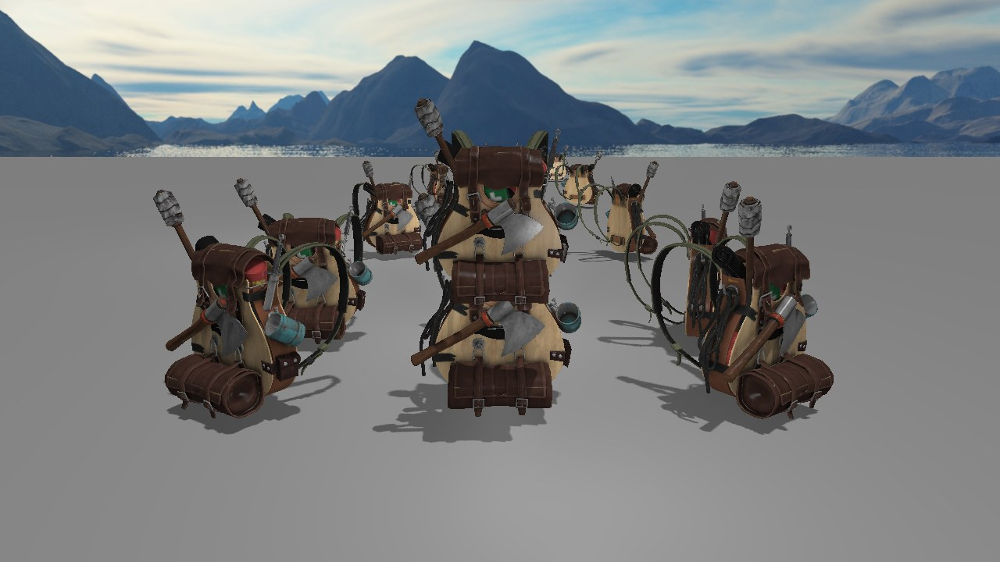
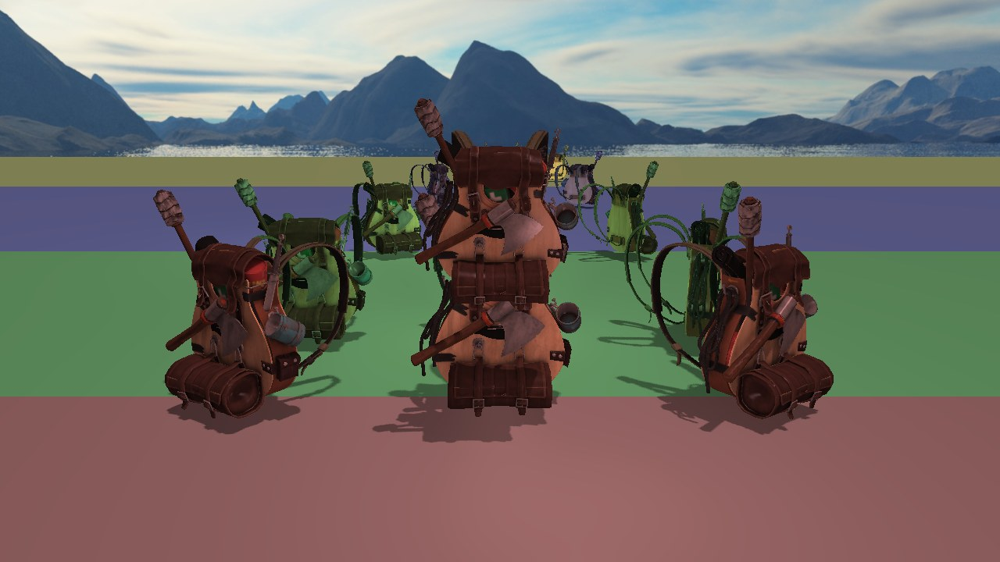
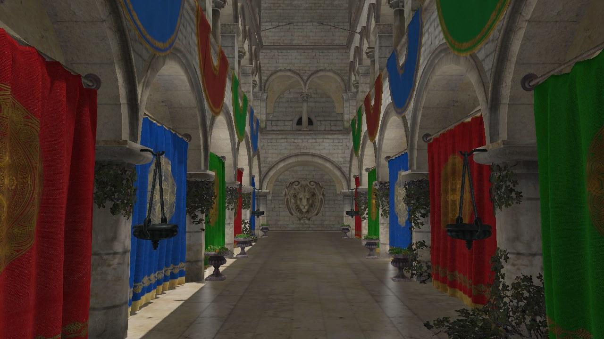

# OpenGL Renderer

A small real-time renderer in C++17 and OpenGL 4.5 that I use as a playground
to implement rendering techniques from scratch.



## Features

- Forward Blinn-Phong lighting: a sun plus up to 64 point and 16 spot lights,
  all ECS entities with a range
- Cascaded shadow maps for the sun: 4 cascades rendered in one pass with
  geometry shader instancing, per-cascade culling, stabilized against
  shimmering, filtered with 3x3 PCF
- Uniform buffers for per-frame data, direct state access, frustum culling
- Normal mapping, alpha-tested foliage (shadows included)
- sRGB-correct pipeline: HDR color target, gamma correction in post-process
- Model loading through Assimp (OBJ, glTF, FBX...), textures cached and shared
- Entity-component scene built on EnTT, cube map skybox
- Dear ImGui panel to tweak lights and shadow settings live, point lights
  shown as colored spheres

| Cascade debug view (`C`) | Crytek Sponza |
|---|---|
|  |  |

How the shadows work is described in [docs/cascaded-shadow-maps.md](docs/cascaded-shadow-maps.md),
and how C++ and the shaders share data in [docs/shader-interface.md](docs/shader-interface.md).

## Building

Every dependency is vendored in `vendor/` (GLFW, glad, GLM, Assimp, EnTT,
spdlog, stb, Dear ImGui). You need CMake 3.10+, a C++17 compiler and a GPU
driver supporting OpenGL 4.5 (Linux or Windows, macOS stops at 4.1).

```bash
cmake -B build -DCMAKE_BUILD_TYPE=Release
cmake --build build -j
./build/opengl_renderer
```

The project directory is baked into the executable, so it finds `config.txt`
and `res/` from any working directory.

Models are not versioned. The default scene uses the
[LearnOpenGL backpack](https://learnopengl.com/Model-Loading/Model), extracted
into `res/models/backpack/`. Sponza and other test scenes come from
[McGuire's Computer Graphics Archive](https://casual-effects.com/data/).

## Usage

| Input | Action |
|---|---|
| `WASD`, `Space`, `Ctrl` | Move, `Shift` to go faster |
| Mouse, scroll | Look around, zoom |
| `Left` / `Right` | Turn the sun around |
| `Up` / `Down` | Raise / lower the sun |
| `L` | Toggle the point and spot lights, leaving only the sun |
| `C` | Toggle the cascade debug view |
| `Tab` | Free the mouse to use the debug panel, and back |
| `F1` | Hide the debug panel |
| `F12` | Save a screenshot to `screenshots/` |

Any model can be opened directly:

```bash
./build/opengl_renderer --model path/to/scene.gltf --scale 0.01
./build/opengl_renderer --help
```

`--screenshot out.png` renders a few frames, saves them and quits, which is
how the images above were made.

## Code layout

```
src/
  application/  window, main loop, test scenes
  core/         config, logging, exceptions
  gl/           RAII wrappers for OpenGL objects
  rendering/    render passes, materials, lights
  resource/     Assimp import, texture/shader/model caches
  scene/        EnTT scene, components, camera
  ui/           Dear ImGui debug panel
res/shaders/    GLSL sources, common/ holds the shared uniform blocks
```

A frame goes through `ForwardRenderer`: shadow pass, lighting pass into an HDR
target, then a post-process pass to the window.

## Next

See [TODO.md](TODO.md).
