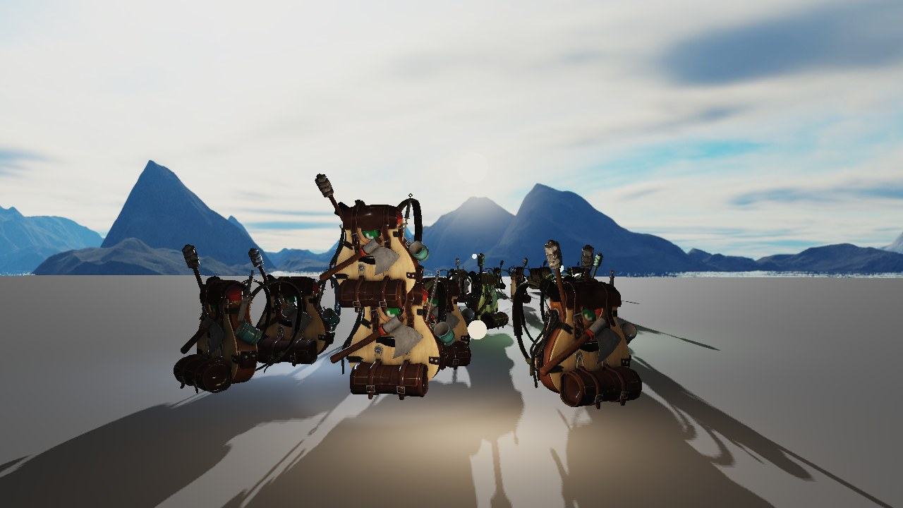
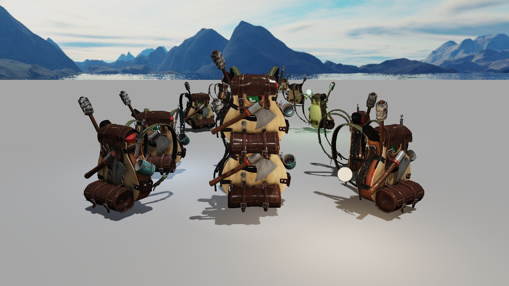
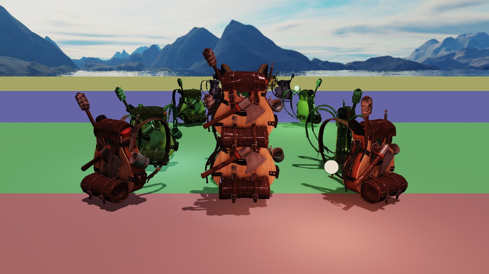
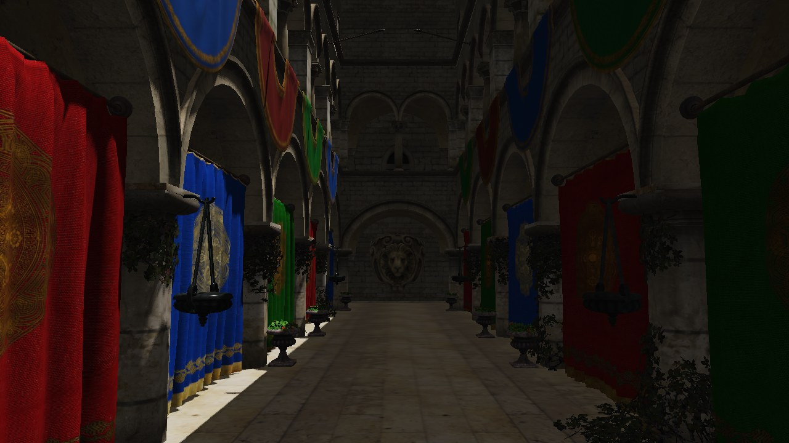
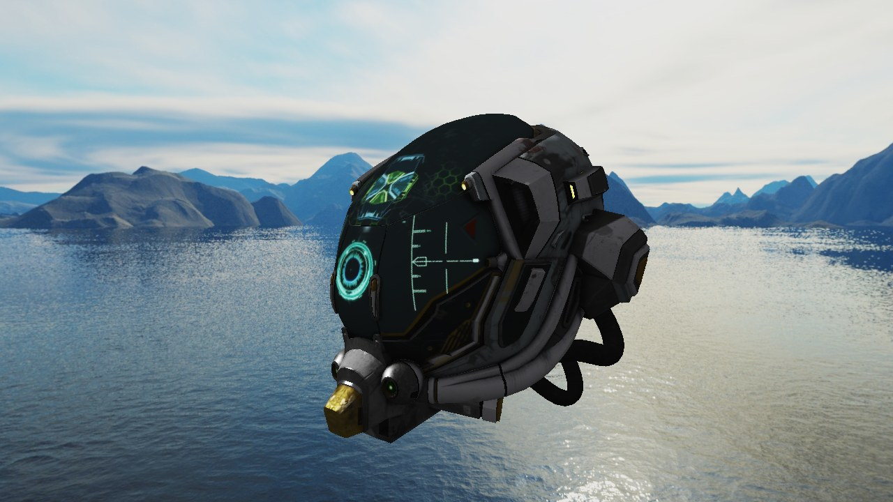
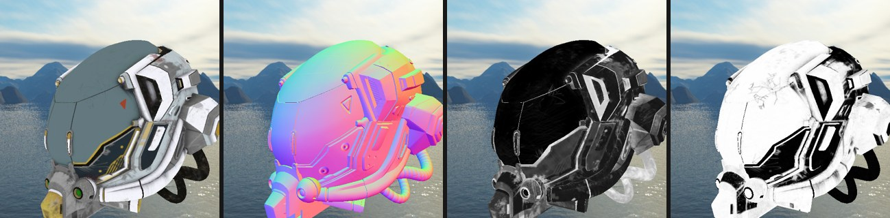
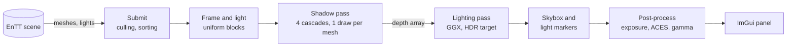

<h1 align="center">OpenGL Renderer</h1>

<p align="center">
  A real-time renderer written from scratch in C++17 and OpenGL 4.5,<br>
  used as a playground to implement and understand rendering techniques.
</p>

<p align="center">
  
  
  
  
</p>

<p align="center">
  
</p>

<p align="center">
  <a href="#features">Features</a> •
  <a href="#gallery">Gallery</a> •
  <a href="#getting-started">Getting started</a> •
  <a href="#controls">Controls</a> •
  <a href="#architecture">Architecture</a> •
  <a href="#documentation">Documentation</a> •
  <a href="#roadmap">Roadmap</a>
</p>

## Features

**Shading**
- Physically based materials (glTF metallic-roughness): albedo, metallic,
  roughness, normal, occlusion and emissive maps
- Cook-Torrance BRDF: GGX distribution, height-correlated Smith visibility,
  Schlick Fresnel
- OBJ and other Phong materials converted on import (`Kd`, `Ks`, `Ns`, `Ke`)
- HDR rendering, exposure and ACES filmic tone mapping, sRGB-correct pipeline

**Lights and shadows**
- A sun plus up to 64 point and 16 spot lights, all ECS entities with a
  finite range and windowed inverse-square falloff
- Cascaded shadow maps for the sun: 4 cascades in a single pass with
  geometry shader instancing, per-cascade culling, texel snapping against
  shimmering, normal offset and slope-scaled bias, 3x3 PCF
- Alpha-tested foliage and fences, in both the lighting and the shadows

**Engine**
- Per-frame data in std140 uniform blocks, shared between C++ and GLSL
  through a single interface header
- Direct state access and immutable storage for every OpenGL object
- Frustum culling, draw sorting by material
- Shader preprocessor with `#include` and injected constants
- Assimp import (OBJ, glTF, FBX...), shared caches for textures, shaders
  and models
- Entity-component scene on EnTT

**Tooling**
- Dear ImGui panel to edit lights, shadows, exposure and the camera live
- Debug views for each material channel and for the shadow cascades
- Sun drawn in the sky and light markers, to check lighting at a glance
- Command-line scene loading and screenshots, for scripted captures
- Debug groups around every pass for RenderDoc and Nsight

## Gallery

| Cascaded shadow maps | Cascade debug view |
|:---:|:---:|
|  |  |
| **Crytek Sponza** (converted OBJ materials) | **Damaged Helmet** (glTF PBR) |
|  |  |


<p align="center"><sub>Albedo, normals, roughness and metallic debug views of the Damaged Helmet</sub></p>

## Getting started

### Requirements

- A C++17 compiler (GCC, Clang or MSVC) and CMake 3.10+
- A GPU and driver supporting OpenGL 4.5. Developed on Linux with Mesa.
  Windows should work but is untested. macOS stops at OpenGL 4.1 and is not
  supported.

Every library is vendored in `vendor/`, nothing else to install.

### Build and run

```bash
git clone https://github.com/Mounarkk/OpenGL-renderer.git
cd OpenGL-renderer
cmake -B build -DCMAKE_BUILD_TYPE=Release
cmake --build build -j
./build/opengl_renderer
```

The project directory is baked into the executable, so it finds `config.txt`
and `res/` from any working directory.

### Assets

Models are not versioned, download them into `res/models/`:

| Scene | Source | Folder |
|---|---|---|
| Default scene (backpack) | [LearnOpenGL](https://learnopengl.com/Model-Loading/Model) | `res/models/backpack/` |
| Sponza, Cornell Box, San Miguel... | [McGuire Computer Graphics Archive](https://casual-effects.com/data/) | any |
| glTF PBR test models | [Khronos glTF Sample Assets](https://github.com/KhronosGroup/glTF-Sample-Assets) | the `glTF` folder of a model |

Embedded textures (`.glb`) are not supported yet.

## Controls

| Input | Action |
|---|---|
| `WASD` `Space` `Ctrl` | Move, hold `Shift` to go faster |
| Mouse, scroll | Look around, zoom |
| `←` `→` / `↑` `↓` | Turn / raise the sun |
| `L` | Toggle the point and spot lights |
| `C` | Toggle the cascade debug view |
| `Tab` | Switch the mouse between the camera and the panel |
| `F1` | Hide the panel |
| `F12` | Save a screenshot to `screenshots/` |

| Option | Effect |
|---|---|
| `--model <file>` | Open a model instead of the default scene |
| `--scale <factor>` | Uniform scale of the model |
| `--flip-uvs` | For files authored with a top-left UV origin |
| `--camera x,y,z,yaw,pitch` | Initial camera, angles in degrees |
| `--sun azimuth,elevation` | Initial sun direction, in degrees |
| `--sun-only` | Start without the point and spot lights |
| `--cascades` | Start with the cascade debug view |
| `--debug-view <channel>` | `albedo`, `normals`, `metallic`, `roughness`, `occlusion` or `emissive` |
| `--screenshot <file>` | Render a few frames, save a PNG and quit |

```bash
# The Sponza shot of the gallery
./build/opengl_renderer --model "res/models/sponza/sponza.obj" --scale 0.01 \
    --camera -11,1.5,-0.5,0,5 --screenshot sponza.png
```

## Architecture

A frame of the forward renderer:


```mermaid
flowchart LR
    Scene[(EnTT scene)] -->|meshes, lights| Submit[Submit<br/>culling, sorting]
    Submit --> UBO[Frame and light<br/>uniform blocks]
    UBO --> Shadow[Shadow pass<br/>4 cascades, 1 draw per mesh]
    Shadow -->|depth array| Lighting[Lighting pass<br/>GGX, HDR target]
    Lighting --> Sky[Skybox and<br/>light markers]
    Sky --> Post[Post-process<br/>exposure, ACES, gamma]
    Post --> UI[ImGui panel]
```

```
src/
├── application/   window, main loop, test scenes, command line
├── core/          configuration, logging, exceptions
├── gl/            RAII wrappers over OpenGL objects (DSA)
├── rendering/     renderer, passes, materials, frustum, shader interface
├── resource/      Assimp import, texture, shader and model caches
├── scene/         EnTT scene, components, camera
└── ui/            Dear ImGui debug panel
res/shaders/       GLSL, common/ holds the shared uniform blocks and BRDF
docs/              notes on the techniques
```

## Documentation

Notes written while implementing each technique, with the reasoning behind
the choices:

- [Cascaded shadow maps](docs/cascaded-shadow-maps.md): splits, stable
  fitting, single-pass rendering, biasing
- [Physically based shading](docs/pbr.md): material model, BRDF, conversion
  of older formats, tone mapping
- [Shader interface](docs/shader-interface.md): uniforms, uniform blocks,
  binding points, std140

## Roadmap

- [x] Cascaded shadow maps
- [x] OpenGL 4.5, uniform buffers, ECS lights, frustum culling
- [x] Physically based materials and tone mapping
- [ ] Image based lighting
- [ ] Spot light shadows, point light shadow atlas
- [ ] Clustered light culling in compute
- [ ] Volumetric fog

Details in [TODO.md](TODO.md).

## Acknowledgements

Libraries: [GLFW](https://www.glfw.org/), [glad](https://github.com/Dav1dde/glad),
[GLM](https://github.com/g-truc/glm), [Assimp](https://github.com/assimp/assimp),
[EnTT](https://github.com/skypjack/entt), [spdlog](https://github.com/gabime/spdlog),
[stb](https://github.com/nothings/stb) and
[Dear ImGui](https://github.com/ocornut/imgui).

Damaged Helmet by theblueturtle_
([CC BY-NC 4.0](https://creativecommons.org/licenses/by-nc/4.0/)), glTF
conversion by ctxwing
([CC BY 4.0](https://creativecommons.org/licenses/by/4.0/)).
