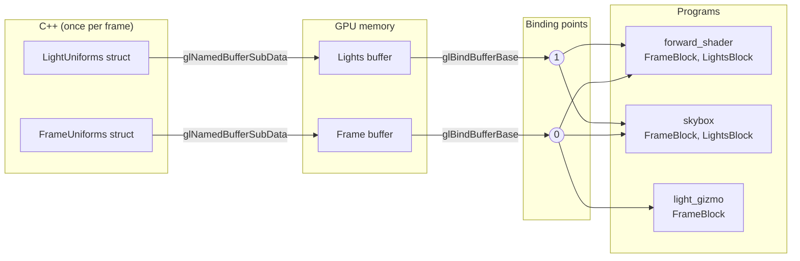

# Shader interface

How data goes from C++ to the shaders: what a uniform is, what a uniform
block is, how the blocks of this renderer are built and why.

Code: `src/rendering/ShaderInterface.h`, `Renderer::beginFrame` in
`src/rendering/Renderer.cpp`, `src/gl/UniformBuffer.*` and the blocks in
`res/shaders/common/`.

## 1. Uniforms

A shader runs once per vertex or per pixel, millions of times per frame.
Most of its inputs change on every invocation (vertex position, texture
coordinates). A **uniform** is the opposite: a value that stays the same for
the whole draw call, identical for every invocation. The camera matrix, the
color of a light or the shininess of a material are uniforms.

```glsl
uniform mat4 uModel;   // declared in the shader
```

```cpp
shader.setMat4("uModel", model);   // set from C++ before drawing
```

Uniforms declared like this live in the program's **default block**. Each
program has its own copy: the driver stores the values inside the program
object. Setting one means:

1. Finding its location, an integer handle the linker assigned to the name
   (`glGetUniformLocation`, cached by `Shader`).
2. Calling `glProgramUniform*` with that location, which copies the value
   into that program's storage.

This is simple and it is what we still use for `uModel` and the material
factors. It has two costs that grow with the renderer:

- **One call per value.** A light is 7 values, 5 lights are 39 calls, each
  going through the driver's validation.
- **One copy per program.** Three shaders need the camera: three sets of
  calls, and three places to forget one.

## 2. Uniform blocks

A **uniform block** groups uniforms under one name, with a fixed memory
layout:

```glsl
layout (std140, binding = 0) uniform FrameBlock {
    mat4 view;
    mat4 projection;
    mat4 viewProjection;
    vec4 cameraPosition;
    vec4 viewport;
} frame;               // instance name, members are read as frame.view
```

The block has no storage of its own. It is a **view on a buffer**: a
contiguous piece of GPU memory, the same kind of object as a vertex buffer,
created and filled from C++. The shader reads the block's members straight
from that memory.

So the values leave the program. Several programs can declare the same block
and read the same buffer, and C++ fills that buffer with one memory copy
instead of one call per value.

A buffer used this way is called a **uniform buffer object** (UBO).

## 3. Binding points

The link between a block in a program and a buffer goes through a numbered
slot, the **binding point**. There are several dozen of them, the exact
count is `GL_MAX_UNIFORM_BUFFER_BINDINGS`.



- The **program side** is fixed in GLSL with `layout(binding = N)`: this
  block reads slot N. Before OpenGL 4.2 this had to be set from C++ with
  `glUniformBlockBinding`, per program.
- The **buffer side** is set from C++ with `glBindBufferBase`: this buffer
  goes in slot N. It is global state, it stays until another buffer takes
  the slot, and switching programs does not change it.

This is why the renderer binds its buffers once at the start of the frame and
never touches them again while drawing: every program that declares the
block finds the right data in the slot.

## 4. Memory layout: std140

C++ and GLSL must agree on where each member sits in the buffer, byte for
byte. By default the layout is up to the driver, so `layout(std140)` asks for
a standard, predictable one. Its main rules:

| Type | Size | Alignment (offset must be a multiple of) |
|---|---|---|
| `float`, `int` | 4 | 4 |
| `vec2` | 8 | 8 |
| `vec3` | 12 | **16** |
| `vec4` | 16 | 16 |
| `mat4` | 64 | 16 (four `vec4` columns) |
| array element | rounded up to 16 | 16 |
| struct | rounded up to 16 | 16 |

The traps are `vec3` and arrays. In this block:

```glsl
uniform Example {
    vec3 position;   // offset 0, 12 bytes
    float range;     // offset 12, fits in the hole after the vec3
    vec3 color;      // offset 16
    float values[4]; // offset 32, but each float takes 16 bytes
};
```

the C++ struct written naively (`glm::vec3`, `float`, `glm::vec3`,
`float[4]`) would put `values` at offset 28, with 4-byte elements. The shader
would read garbage past the first element.

To stay out of these rules, the blocks of this renderer only use `vec4`,
`ivec4` and `mat4` members. Their size is a multiple of 16 and their
alignment is 16, so the C++ layout with `glm::vec4`/`glm::mat4` is exactly
the std140 layout without any padding. Values that do not need four
components are packed together:

```cpp
struct PointLightUniforms {
  glm::vec4 positionRange; // xyz position, w range
  glm::vec4 radiance;      // rgb color * intensity, w unused
};
```

`ShaderInterface.h` checks sizes and offsets with `static_assert`, so a
mistake is a compile error instead of lights showing up in the wrong place.

## 5. The blocks of this renderer

| Block | Binding | Size | Content | Written by |
|---|---|---|---|---|
| `FrameBlock` | 0 | 224 B | view, projection and their product, camera position, near/far planes | `Renderer::beginFrame` |
| `LightsBlock` | 1 | 2880 B | sun, light counts, 64 point lights, 16 spot lights | `Renderer::beginFrame` |
| `ShadowBlock` | 2 | 352 B | 4 cascade matrices, split distances, texel sizes, bias settings, flags | `ShadowMappingPass::execute` |

The frame of the renderer, seen from the blocks:

1. `Renderer::submit` walks the scene: meshes become render commands, light
   components are converted into `LightUniforms` (world position, range,
   color times intensity, cone cosines).
2. `Renderer::beginFrame` fills `FrameUniforms` from the camera, uploads both
   structs with `glNamedBufferSubData` and binds the buffers to slots 0 and 1.
   Only the used part of the spot light array is copied.
3. The shadow pass computes the cascades, uploads `ShadowUniforms` and binds
   it to slot 2. Its geometry shader reads the cascade matrices from there.
4. The lighting pass, the skybox and the light markers draw. None of them sets
   a camera or light uniform: they read the slots.

Only per-draw values stay in the default block: `uModel`, the material
factors, and the cascade mask of the shadow pass.

## 6. Sizes and limits

A uniform block is guaranteed at least 16 KB (`GL_MAX_UNIFORM_BLOCK_SIZE`),
often 64 KB on desktop GPUs. That is why the light arrays have a fixed
maximum: the block size is decided at compile time, and the shader loops
only over `lights.counts.x` entries.

For thousands of lights or per-object data, the next step is the **shader
storage buffer** (SSBO, OpenGL 4.3). It works the same way (`binding`, a
buffer in a slot), but can be as large as GPU memory, can end with an array
whose size is only known at run time, and can be written by shaders. Uniform
blocks stay the better choice for small data read by every invocation, which
GPUs cache very well.

## 7. Textures follow the same idea

A sampler is also a slot reference. `layout(binding = ALBEDO_UNIT)` fixes the
**texture unit** a sampler reads, and `glBindTextureUnit(unit, texture)` puts
a texture in that unit from C++. Before, every sampler needed a
`glUniform1i(location, unit)` per program. Now the units are part of the
shader source.

| | Uniform blocks | Samplers |
|---|---|---|
| Slot | binding point | texture unit |
| Fixed in GLSL by | `layout(binding = N)` | `layout(binding = N)` |
| Filled from C++ by | `glBindBufferBase` | `glBindTextureUnit` |

## 8. Shared constants

Binding points, texture units and array sizes appear on both sides. They are
defined once, in `ShaderInterface.h`, and the shader loader inserts them as
`#define`s right after the `#version` line of every stage:

```glsl
#version 450 core
#define FRAME_BLOCK 0
#define LIGHTS_BLOCK 1
...
#define MAX_POINT_LIGHTS 64
#line 2 0
```

GLSL code then writes `binding = FRAME_BLOCK` or `MAX_POINT_LIGHTS` and can
never disagree with the C++ side. Changing a limit is a one-line change.

## 9. Includes

GLSL has no `#include`. The loader expands `#include "path"` itself, relative
to the including file, once per file and stage, so each block is declared in
a single file of `res/shaders/common/`.

After an include, the loader inserts a `#line` directive so that the driver
reports errors with the right line. Each file gets a number: errors read
`<file number>:<line>`, and the list of numbered files is printed with them.
